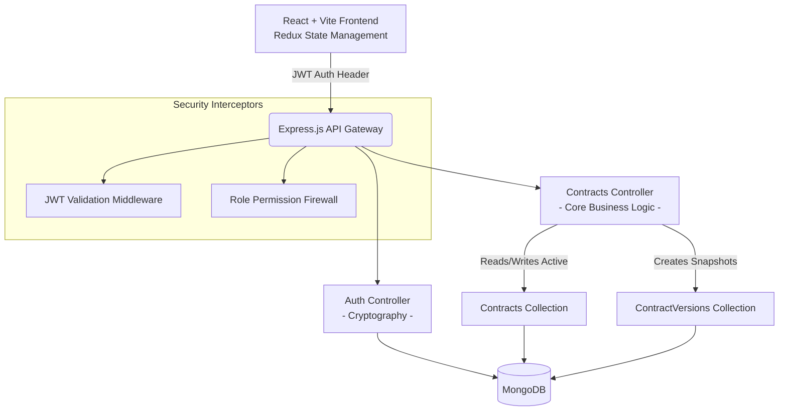
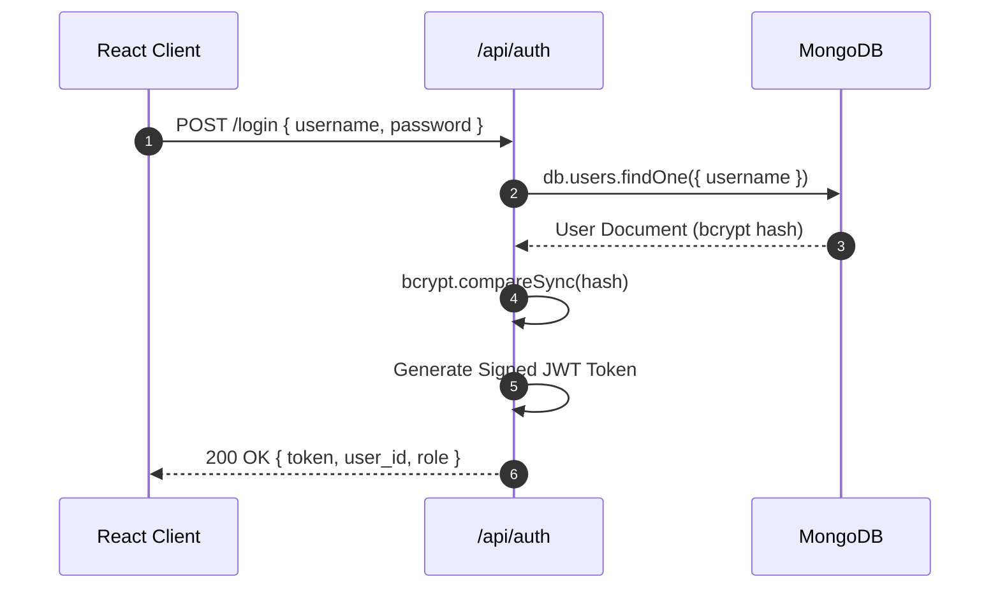
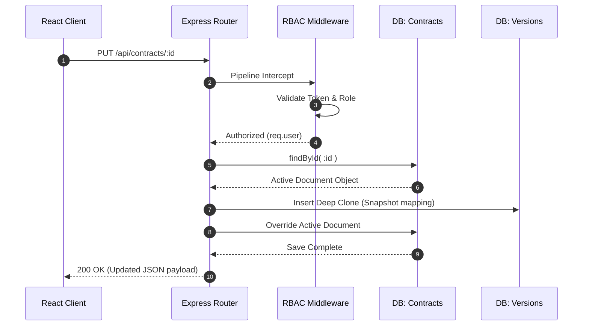

<div align="center">
  <h1>📑 Enterprise Contract Lifecycle Management System</h1>
  <p><i>A robust, full-stack application designed for secure, auditable, and centralized contract management.</i></p>
  
  
  
  
  
  
</div>

<br />

## 📖 Table of Contents
1. [Application Overview](#-application-overview)
2. [System Architecture](#-system-architecture)
3. [Deep Dive: Core Features](#-deep-dive-core-features)
4. [Technology Stack](#-technology-stack)
5. [Directory Structure](#-directory-structure)
6. [Comprehensive API Reference](#-comprehensive-api-reference)
7. [Database Schema Map](#-database-schema-map)
8. [Getting Started (Setup)](#-getting-started-setup)

---

## 🚀 Application Overview

The **Contract Management Dashboard** resolves the complexities of managing sensitive corporate agreements globally or at scale. Built with uncompromising security and deep data tracing, it acts as a centralized vault that strictly prevents data tampering while providing rapid search and lifecycle management.

Rather than relying on heavy UI templates, the system boasts a zero-bloat custom design system built entirely from scratch with **Vanilla CSS variables**, achieving a fluid "Glassmorphism" aesthetic with optimal browser rendering speeds.

---

## 🏗 System Architecture



---

## 🔥 Deep Dive: Core Features

### 1. 🛡️ Role-Based Access Control (RBAC) & Data Cordoning
- **Admin Axis**: Admins operate with global privileges—capable of viewing, mutating, and archiving all organizational contracts.
- **User Axis**: Normal users are sandboxed. The API middleware intercepts incoming tokens and dynamically rewrites Mongoose queries so Users can only interact with contracts explicitly bound to their `userId`.

### 2. 🕰️ Immutable Version History
- **The Problem**: Overwriting a contract destroys historical context, which is illegal in compliance-heavy industries.
- **The Solution**: On every `PUT` request, a programmatic transaction occurs. The system deeply clones the *previous* contract state and dumps it into a parallel `ContractVersions` collection. This prevents document bloating in the main collection while creating an impenetrable, chronological audit trail.

### 3. 🔍 Algorithmic Visual Diffing
- Pulling the raw JSON snapshots from the `ContractVersions` collection, the React client runs a structural comparison algorithm against the current active iteration of the contract, rendering a line-by-line mapping of exactly what data changed, when, and by whom.

### 4. 🗑️ Compliant Soft Deletion
- Standard destructive database protocols (`.remove()` or `DELETE FROM`) are blacklisted. Deleting heavily sensitive legal documents is achieved by toggling an `isDeleted` cryptographic flag. This visually strips the record from the dashboard but retains it indefinitely within the database for forensic audits.

---

## 💻 Technology Stack

### Frontend Ecosystem
| Technology | Role / Purpose |
|---|---|
| **React 18** | UI rendering engine, component orchestration |
| **Vite** | Blazing-fast build tool and local dev server (HMR focused) |
| **Redux Toolkit** | Centralized global state management; dispatching async thunks |
| **React Router v6** | Client-side declarative routing and URL parameter parsing |
| **Vanilla CSS** | Layout control via Flex/Grid and design tokens/variables |

### Backend Ecosystem
| Technology | Role / Purpose |
|---|---|
| **Node.js (v18+)** | High-performance, event-driven JavaScript runtime |
| **Express.js** | Minimalist API routing, middleware chaining |
| **MongoDB** | NoSQL document database scaling horizontally |
| **Mongoose ODM** | Data modeling, strict schema casting, and lifecycle hooks |
| **Bcrypt.js** | Mathematical salt/hashing functionality for user passwords |
| **JSON Web Tokens** | Stateless session management via cryptographically signed tokens |

---

## 📂 Directory Structure

<details>
<summary><b>Click to expand folder and file hierarchy</b></summary>
<br />

```text
contract-management/
│
├── backend/
│   ├── config/
│   │   └── db.js                 # Mongoose connection instantiation
│   ├── controllers/
│   │   ├── authController.js     # Logic for login/registration
│   │   └── contractController.js # CRUD handlers and versioning logic
│   ├── middleware/
│   │   ├── authMiddleware.js     # JWT extraction/validation
│   ├── models/
│   │   ├── Contract.js           # Mongoose Base Schema
│   │   ├── ContractVersion.js    # Mongoose History Schema
│   │   └── User.js               # Mongoose Identity Schema
│   ├── routes/                   
│   │   ├── authRoutes.js         # Endpoint definitions for /api/auth
│   │   └── contractRoutes.js     # Endpoint definitions for /api/contracts
│   ├── server.js                 # Express Application Entry Point
│   └── .env                      # Environment Variables
│
└── frontend/
    ├── public/                   # Static icon sets and meta assets
    ├── src/
    │   ├── components/           # Dumb & Smart UI widgets (Modals, Tables)
    │   ├── pages/                # Top level routable containers (Dashboard)
    │   ├── store/                
    │   │   ├── slices/           # Redux logic (authSlice.js, contractSlice.js)
    │   │   └── store.js          # Root Redux configuration
    │   ├── App.jsx               # Root Route definition
    │   ├── main.jsx              # DOM Mounting point
    │   └── index.css             # Vanilla CSS Variables / Typography
    └── vite.config.js            # Bundler configurations
```
</details>

---

## 🔌 Comprehensive API Reference & Data Flows

**Base URL**: `http://localhost:5000/api`  
*Authorization Header Required for protected routes: `Bearer <JWT_STRING>`*

### 1. Identity & Auth (`/auth`)



<details>
<summary><b>POST</b> <code>/auth/register</code> - Provision Identity</summary>

- **Access Level**: Public
- **Request Body**:
  ```json
  {
    "username": "johndoe",
    "password": "SecurePassword123!",
    "role": "User" 
  }
  ```
- **Response**: JWT Token + User Object string.
</details>

<details>
<summary><b>POST</b> <code>/auth/login</code> - Authenticate Identity</summary>

- **Access Level**: Public
- **Request Body**:
  ```json
  {
    "username": "johndoe",
    "password": "SecurePassword123!"
  }
  ```
- **Response Shape**:
  ```json
  {
    "_id": "64abcdef1234567890abcdef",
    "username": "johndoe",
    "role": "User",
    "token": "eyJhbGci...<JWT_TOKEN>"
  }
  ```
</details>

---

### 2. Contract Mutations & Snapshotting (`/contracts`)



<details>
<summary><b>GET</b> <code>/contracts/</code> - Fetch Collection</summary>

- **Access Level**: `Admin` (Returns all active) | `User` (Returns owned active) 
- **Response Shape**:
  ```json
  [
    {
      "_id": "64f1a23...",
      "title": "Vendor Service Agreement",
      "status": "Active",
      "parties": ["Acme Corp", "Globex"],
      "createdBy": "64abcdef1...",
      "createdAt": "2023-09-01T12:00:00Z"
    }
  ]
  ```
</details>

<details>
<summary><b>POST</b> <code>/contracts/</code> - Initialize Contract</summary>

- **Access Level**: Admin / User
- **Request Body**:
  ```json
  {
    "title": "Vendor Service Agreement",
    "description": "Standard service SLA for Q3",
    "parties": ["Acme Corp", "Globex"],
    "status": "Draft",
    "startDate": "2023-10-01",
    "endDate": "2024-10-01"
  }
  ```
</details>

<details>
<summary><b>PUT</b> <code>/contracts/:id</code> - Update & Snapshot</summary>

- **Access Level**: Admin / Mapped User
- **Mechanism**: Modifying data here triggers the backend to clone the existing state to `ContractVersions` before applying this update payload.
- **Request Body**: Accepts any modifiable database columns matching the Schema.
</details>

<details>
<summary><b>DELETE</b> <code>/contracts/:id</code> - Soft Delete</summary>

- **Access Level**: `Admin` Only
- **Mechanism**: Toggles the `isDeleted` cryptographic flag to true.
</details>

---

### 3. Historical Tracking (`/contracts/:id/history`)

<details>
<summary><b>GET</b> <code>/contracts/:id/history</code> - Fetch Snapshots</summary>

- **Access Level**: Admin / Mapped User
- **Response Shape**:
  ```json
  [
    {
      "versionNumber": 2,
      "snapshot": { 
         "title": "Vendor Service Agreement", 
         "status": "Draft" 
      },
      "updatedBy": "64abcdef1..."
    }
  ]
  ```
</details>

---

## 🗄️ Database Schema Map

Below are the detailed Mongoose Data Models defining the NoSQL JSON documents.

### `User` Collection
| Field | Type | Attributes | Description |
|---|---|---|---|
| `username` | String | `required`, `unique` | Authentication credential |
| `password` | String | `required` | Automatically hashed pre-save via bcrypt |
| `role` | String | `enum: ['Admin', 'User']` | Governs RBAC middleware logic |

### `Contract` Collection
| Field | Type | Attributes | Description |
|---|---|---|---|
| `title` | String | `required` | Primary identifier |
| `description` | String | optional | Full text body |
| `parties` | [String] | optional | Array of associated organizations/entities |
| `startDate` | Date | optional | Effective commencement date |
| `endDate` | Date | optional | Expected termination/renewal date |
| `status` | String | `enum: ['Draft', 'Active', 'Executed', 'Expired']` | Lifecycle stage |
| `createdBy` | ObjectId | `required`, `ref: 'User'` | Defines ownership mapping |
| `isDeleted` | Boolean | `default: false` | Application driver for the Soft Delete module |

### `ContractVersion` Collection 
| Field | Type | Attributes | Description |
|---|---|---|---|
| `contractId` | ObjectId | `required`, `ref: 'Contract'` | Relational link to the master document |
| `versionNumber` | Number | `required` | Chronological iteration count validation |
| `snapshot` | Object | `required` | Serliazed dynamic mapping of previous state |
| `updatedBy` | ObjectId | `required`, `ref: 'User'` | Maps the specific identity that triggered the edit |

---

## ⚡ Getting Started (Setup)

Follow these instructions to run the Frontend Vite interface & Backend Express server concurrently.

### 1. Pre-requisites
- **Node.js**: v18.x or above.
- **MongoDB**: Running locally at `mongodb://127.0.0.1:27017` or via an Atlas connection.

### 2. Environment Variables Configuration
Navigate to the `backend/` directory, and create an `.env` file mapping out the core parameters:
```env
PORT=5000
MONGO_URI=mongodb://127.0.0.1:27017/contract-manager
JWT_SECRET=your_hyper_secure_random__jwt_string
```

### 3. Node Modules Installation
At the **root directory**, execute the overarching dependency script:
```bash
npm install
npm run install-all
```
*(This triggers a concurrent package resolution for both frontend and backend domains).*

### 4. Concurrent Application Boot
Start the system watcher:
```bash
npm run start
```
- 🌐 **Frontend Client Portal**: `http://localhost:5173`
- 🖥️ **Backend API Interface**: `http://localhost:5000`

---
> 🚀 *Precision engineered for rigorous security protocols without sacrificing user interface aesthetic latency.*
s.txt
Displaying s.txt. 
